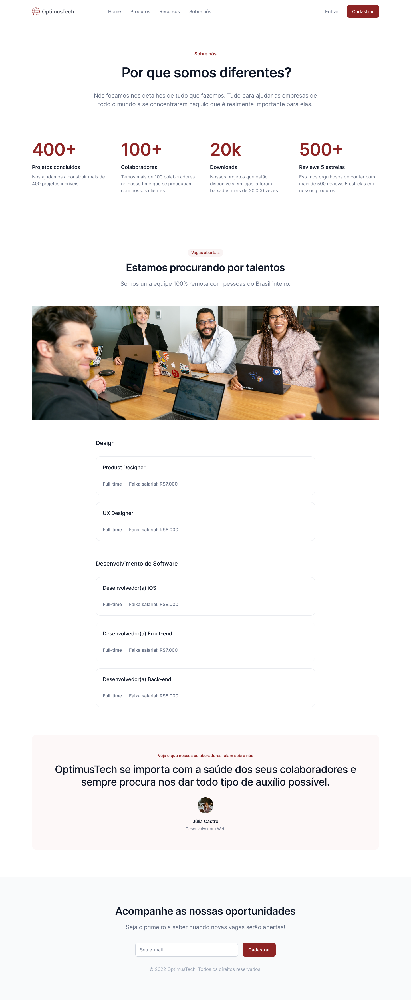

# #07daysOfCode - HTML e CSS  👩🏾‍💻 

&nbsp;
&nbsp;
&nbsp;
&nbsp;
 

### Desafio proposto por [Giovanna Moeller e Alura](https://7daysofcode.io/matricula/html-css) com o objetivo de colocar em prática os conhecimentos de HTML e CSS, nos próxinos 7 dias.  
Abordando conceitos importantes, como alinhamento, inserção de imagens, separação de blocos e sub-blocos, além de Flexbox, Grid e outros.  

### Qual será o desafio?  
>**Desenvolver uma página destina a novas contratações para uma empresa de TI.**  

Acesse o protótipo do site no 
[Figma](https://www.figma.com/file/mm3MLozvUDGhDRTxSLlGL5/7daysOfCode-HTML-CSS).

